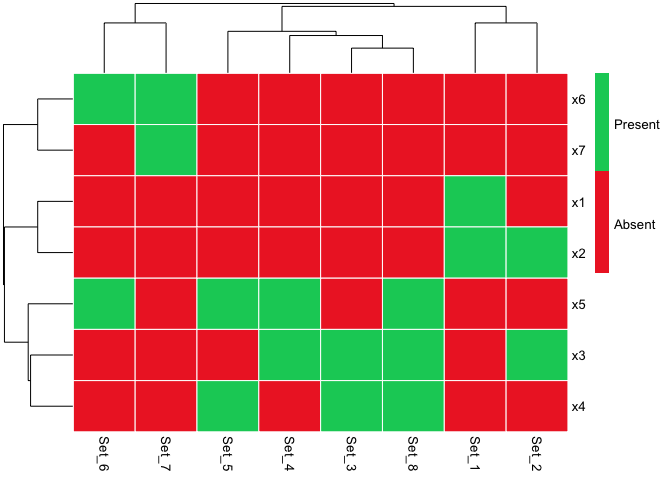

# setweaver

*setweaver* is an R package designed to help users create sets of
variables based on a mutual information approach. In this context, a set
is a collection of distinct elements (e.g., variables) that can also be
treated as a single entity. Mutual information, a concept from
probability theory, quantifies the dependence between two variables by
expressing how much information about one variable can be gained from
observing the other.

## Authors

[Aaron Fisher](https://psychology.berkeley.edu/people/aaron-fisher)  
[Nicolas Leenaerts](https://nicolasleenaerts.github.io/)

## Installation

You can install *setweaver* with the following code snippet:

``` r
devtools::install_github('nicolasleenaerts/setweaver')
```

## Pairing variables

You can create sets of variables using the *pairmi* function, which
takes a dataframe of variables and pairs them up to a specified maximum
number of elements. For each set, the mutual information between the
variables is computed, followed by the calculation of a G-statistic.
This statistic is then evaluated for significance based on a chi-squared
distribution with a predefined alpha level. Alternatively, users can
specify a mutual information threshold to determine the significance of
the sets.

``` r
# Loading the package, which automatically also downloads the example data (misimdata)
library(setweaver) 

# Pairing variables
results = pairmi(misimdata[,2:11],alpha = 0.05,n_elements = 5)

# View data with sets added
View(results$expanded.data)
```

| x1  | x2  | x3  | x4  | x5  | x6  | x7  | x8  | x9  | x10 | x1_x2 | x2_x3 | x3_x4 | x3_x5 | x4_x5 | x5_x6 | x6_x7 | x3_x4_x5 |
|:---:|:---:|:---:|:---:|:---:|:---:|:---:|:---:|:---:|:---:|:-----:|:-----:|:-----:|:-----:|:-----:|:-----:|:-----:|:--------:|
|  1  |  0  |  0  |  0  |  1  |  0  |  1  |  0  |  1  |  0  |   0   |   0   |   0   |   0   |   0   |   0   |   0   |    0     |
|  1  |  1  |  1  |  0  |  1  |  0  |  1  |  0  |  1  |  1  |   1   |   1   |   0   |   1   |   0   |   0   |   0   |    0     |
|  1  |  1  |  0  |  0  |  1  |  0  |  1  |  1  |  1  |  1  |   1   |   0   |   0   |   0   |   0   |   0   |   0   |    0     |
|  1  |  0  |  1  |  0  |  1  |  0  |  1  |  1  |  1  |  0  |   0   |   0   |   0   |   1   |   0   |   0   |   0   |    0     |
|  1  |  0  |  0  |  1  |  0  |  1  |  1  |  1  |  1  |  0  |   0   |   0   |   0   |   0   |   0   |   0   |   1   |    0     |

Table 1. Expanded Data

``` r
# View information on the sets
View(results$sets)
```

| n_elements |   set    |    mi     | relative.mi |     p     |
|:----------:|:--------:|:---------:|:-----------:|:---------:|
|     2      |  x1_x2   | 0.0148341 |  0.0000000  | 0.0000972 |
|     2      |  x2_x3   | 0.0112699 |  0.0000000  | 0.0008788 |
|     2      |  x3_x4   | 0.0090465 |  0.0000000  | 0.0048279 |
|     2      |  x3_x5   | 0.0031842 |  0.0000000  | 0.0370173 |
|     2      |  x4_x5   | 0.0102441 |  0.0000000  | 0.0020023 |
|     2      |  x5_x6   | 0.0102347 |  0.0000000  | 0.0013331 |
|     2      |  x6_x7   | 0.0052797 |  0.0000000  | 0.0046674 |
|     3      | x3_x4_x5 | 0.0146543 |  0.0114701  | 0.0142389 |

Table 2. Information on sets

## Evaluating sets

Once the sets are created with the *pairmi* function , you can assess
their relationship with a specific outcome using the *probstat*
function. This function employs k-fold cross-validation to compute
parameters such as conditional probability, conditional entropy, and the
odds ratio of the outcome given a particular set. Additionally, Fisher’s
exact test is performed to determine whether the outcome is
significantly more likely to occur in the presence of a given set of
variables.

``` r
# Evaluating the sets
evaluated_sets = probstat(misimdata$y,results$expanded.data[,results$sets$set],nfolds = 5)
```

|     | xvars |   yprob   | xprob | cprob | cprobx | cprobi | cpdif  | cpdifper | xent  | yent  |  ce   | cedif | cedifper |  OR   | ORmarg |  p  |  rmse   |
|:----|:-----:|:---------:|:-----:|:-----:|:------:|:------:|:------:|:--------:|:-----:|:-----:|:-----:|:-----:|:--------:|:-----:|:------:|:---:|:-------:|
| 1   | x1_x2 | 0.3003999 | 0.205 | 0.166 | 0.113  | 0.335  | -0.134 |  -0.447  | 0.731 | 0.882 | 0.864 | 0.018 |  0.020   | 0.394 | 0.464  |  0  | 0.00706 |
| 6   | x4_x5 | 0.3003999 | 0.186 | 0.193 | 0.120  | 0.325  | -0.107 |  -0.358  | 0.694 | 0.882 | 0.872 | 0.010 |  0.011   | 0.496 | 0.556  |  0  | 0.00706 |
| 2   | x2_x3 | 0.3003999 | 0.196 | 0.200 | 0.130  | 0.325  | -0.101 |  -0.336  | 0.715 | 0.882 | 0.873 | 0.009 |  0.010   | 0.520 | 0.582  |  0  | 0.00706 |
| 3   | x3_x4 | 0.3003999 | 0.176 | 0.203 | 0.119  | 0.321  | -0.098 |  -0.325  | 0.670 | 0.882 | 0.874 | 0.007 |  0.008   | 0.538 | 0.592  |  0  | 0.00706 |
| 5   | x3_x5 | 0.3003999 | 0.273 | 0.227 | 0.206  | 0.328  | -0.074 |  -0.245  | 0.846 | 0.882 | 0.874 | 0.007 |  0.008   | 0.602 | 0.684  |  0  | 0.00706 |

Table 3. Evaluated sets

## Visualizing sets

You can visualize the sets created with the *pairmi* function using the
*setmapmi* function. This function generates a setmap, which illustrates
the composition of sets by showing which original variables are included
in sets of a given size.

``` r
# Visualizing the sets
setmapmi(results$original.variables,results$sets,n_elements = 2)
```

<figure>

<figcaption aria-hidden="true">Plot 1. Setmap of sets that consist of 2
elements</figcaption>
</figure>
